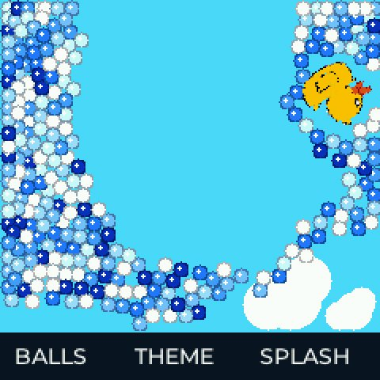
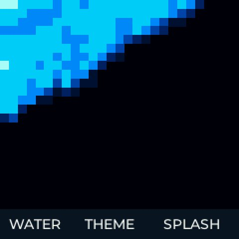

# LiquidDuck for ESP-Mosaico

基于本仓库 StickS3 版本的 MicroPixel 移植，稳定版 0.1.2。保留 FLIP 流体求解器、角色素材和四种模式，使用 MicroPixel 显示、加速度计、触摸与可选音频接口。

## 实机与操作

已验证 ESP-Mosaico V1.2 / ESP32-S31，MicroPixel 0.9.4，480×480 方形屏幕。应用以 240×240 缓冲区进行 2 倍输出，上方 240×210 为模拟区域。

- 倾斜设备改变重力方向。
- 左下角 BALLS / PIXEL / GRAD / WATER 显示当前模式，点击切换。
- THEME 切换配色；海洋球模式同时随机切换角色、背景。
- 海洋球模式点击画面在点击位置产生冲击，SPLASH 触发随机冲击。
- 按钮滑出后松手取消；退出后不保存状态。

提示音可降级；没有移植原设备的振动 GPIO 和电池浮窗。

## 构建与运行

按 [MicroPixel 开发环境](https://micropixel.ai/docs/environment/) 安装 SDK、WASI SDK 和匹配的 WAMRC。此次验证使用 MicroPixel SDK 0.20.1、WASI SDK 33、AOT v6。发布双架构需要 RISC-V 和 Xtensa 两种编译器；只在 Mosaico 上做过实机测试。

```sh
cd mosaico
export MICROPIXEL_SDK_DIR=/path/to/micropixel-sdk
export WASI_SDK_PATH=/path/to/wasi-sdk
export WAMRC=/path/to/riscv-capable/wamrc
export XTENSA_WAMRC=/path/to/xtensa-capable/wamrc
# 可选：export PYTHON=/path/to/venv/bin/python
./micropixel.sh port list
./micropixel.sh --transport usb run . --profile release --no-follow
./micropixel.sh publish . --dry-run
```

`app.json` 保留已验证稳定版的应用 ID。自行上架独立衍生应用前应更换 ID；无需发布账号即可构建和 USB 安装。

## 验证与性能

默认鸭子海洋球约 27–28 FPS；部分多色角色仍使用软件旋转，约 24–25 FPS。PIXEL / GRAD 约29 FPS，WATER 约28–29 FPS。短时实测受运动与主题影响，不是固定输入基准。

双架构构建、真机四模式、触摸交互、错误状态检查及 ASan/UBSan 行为测试已通过；详见 [PERFORMANCE.md](PERFORMANCE.md) 和 [tests/README.md](tests/README.md)。




## 来源与许可

沿用原项目声明的 PolyForm Noncommercial License 1.0.0，仅限非商业用途。原作者 nongxl；此目录为非官方移植。[来源说明](UPSTREAM.md)。
